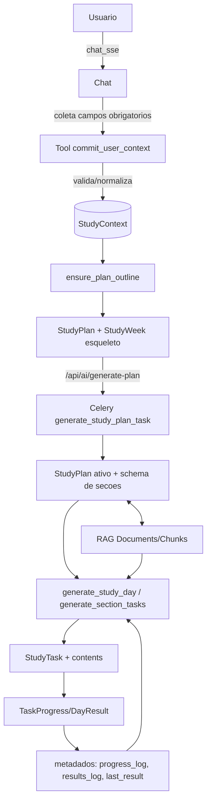

# Sistema basico de gerenciamento de contexto

Este documento descreve como o backend constroi e recicla o `StudyContext` do usuario, disparando planos e tarefas em cima de dados incrementais (progresso, resultados e materiais). O foco e entender onde cada pedaco vive no codigo e como os eventos se encadeiam.

## Componentes principais
- **Coleta de contexto (chat SSE)**: `apps/ai/services/chat.py` guia o onboarding conversacional. Quando todos os campos obrigatorios estao prontos, o modelo chama o tool `commit_user_context`. Opcionalmente preenchido através de formulário na UI.
- **Persistencia normalizada**: `apps/ai/tools/commit_user_context.py` valida e normaliza deadline/horas/consentimento, persiste via `StudyContextSerializer` e aciona `ensure_plan_outline` para garantir um plano base.
- **Outline e sincronizacao**: `apps/ai/services/plan_outline.py` cria ou atualiza um `StudyPlan` esqueleto + semanas datadas sempre que o contexto muda (tanto pelo tool quanto pelo endpoint `/accounts/study-context/`).
- **Geracao com IA**:
  - Plano: `GenerateStudyPlanView` enfileira `generate_study_plan_task` que chama `generate_plan_payload` e `persist_plan_from_payload`.
  - Dias/tarefas: `GenerateStudyDayView` e `GenerateSectionTasksView` enfileiram `generate_study_day_task`/`generate_section_tasks_task` que usam `generate_day_payload`/`generate_tasks_payload` e persistem via `persist_tasks_for_day`/`persist_tasks_for_section`.
- **Materiais e RAG**: uploads entram como `FileRef` e viram `Document` + `Chunk` (RAG) via `PlanMaterialUploadView`/`IndexDocumentView`; planos referenciam documentos em `StudyPlan.rag_documents`.
- **Feedback loop**:
  - Progresso por tarefa: `StudyTaskProgressView` grava `progress_log` e `last_progress` em `StudyTask.metadata`.
  - Resultado agregado do dia: `StudyDayResultView` grava `results_log`/`last_result` em `StudyDay.metadata` e um snapshot em `StudyPlan.metadata["last_day_result"]`.
  - Esses metadados alimentam os prompts em `generate_day_payload` (historico do dia/secao) para adaptar novas geracoes.

## Fluxo ponta a ponta

## Pontos de extensao e observabilidade
- Eventos SSE relevantes (ver `apps/ai/integration_guide.md`):
  - `context_committed` apos `commit_user_context`.
  - `plan_generation_started`/`plan_generation_completed` durante a stream do plano inicial.
  - `session_finished` sempre encerra a sessao com `committed` e `study_context_id`.
- Chaves de estado:
  - `StudyPlan.generation_status` e `last_error` refletem jobs de IA.
  - `StudyDay.metadata["generation_status"]` acompanha geracao de um dia especifico.
  - `StudyTask.status`/`StudyDay.status` sao recalculados conforme progresso.
- Entrada alternativa:
  - `POST /accounts/study-context/` upsert de contexto manual (tambem chama `ensure_plan_outline`).
  - `POST /api/ai/plans/{plan_id}/materials` ingere materiais e os liga ao plano + RAG.

## Ciclo de melhoria continua
1. Onboarding coleta contexto e o persiste.
2. Outline garante plano e semanas sempre coerentes com datas e metas declaradas.
3. Geracoes de plano/dia usam `StudyContext` + materiais + historico para produzir tarefas.
4. Execucao do usuario registra progresso/resultados.
5. Metadados alimentam as proximas chamadas de geracao, mantendo o `StudyContext` vivo e adaptativo.
