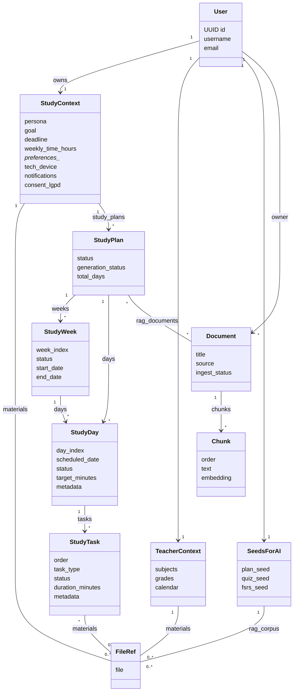
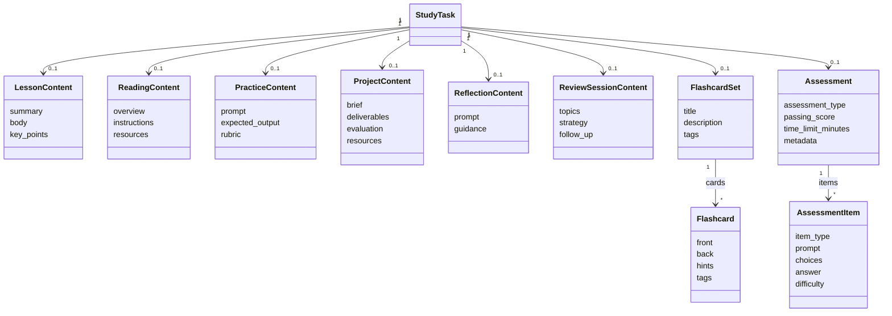

# Modelo de dados (UML)

Panorama completo dos modelos do backend, com diagramas de classe Mermaid cobrindo contexto do usuario, plano de estudos, conteudos e ingestao/RAG.

## Contexto, plano e RAG

## Conteudo, flashcards e avaliacoes

## Notas por dominio
- **Identidade e contexto** (`apps/accounts/models.py`):
  - `User` usa UUID como chave primaria.
  - `StudyContext` centraliza persona, objetivo, deadline, disponibilidade, preferencias e consentimento (LGPD). Um por usuario.
  - `TeacherContext` cobre cenarios docentes; `SeedsForAI` guarda prompts-semente e corpus base (M2M com `FileRef`).
- **Plano de estudo**:
  - `StudyPlan` agrega semanas (`StudyWeek`) e dias (`StudyDay`), com estado de geracao em `generation_status` + `last_error`.
  - `StudyDay.metadata` armazena historico (`results_log`, `last_result`, `prerequisites`, `section_id`), usado pela IA em `generate_day_payload`.
  - `StudyTask` guarda ordem, tipo, duracao, materiais (M2M com `FileRef`) e `metadata.progress_log` vindo de `StudyTaskProgressView`.
- **Conteudo e avaliacao**:
  - Cada `StudyTask` pode ter um bloco 1:1 de conteudo (lesson/reading/practice/project/reflection/review) ou assessment/flashcards.
  - `Assessment` agrega `AssessmentItem` (MCQ/TF/open/short/code) e guarda metadados adicionais.
- **IA e RAG** (`apps/ai/models.py`):
  - `Document` representa material ingerido; `Chunk` guarda texto/embedding com indice HNSW para busca vetorial.
  - `StudyPlan.rag_documents` conecta materiais relevantes por plano; uploads via `PlanMaterialUploadView` tambem vinculam `FileRef` ao `StudyContext`.
- **IDs e ordenacao**:
  - Quase todas as entidades usam UUID como PK, exceto `Chunk` (auto increment) e ordem explicita em `StudyTask.order`, `StudyWeek.week_index`, `StudyDay.day_index`.

## Como ler os relacionamentos
- Setas com `"1"` e `"*"` indicam cardinalidade. `StudyTask "1" --> "0..1" LessonContent` significa um bloco opcional 1:1.
- Linhas com `--` representam M2M (ex.: `StudyPlan` <-> `Document`, `StudyTask` <-> `FileRef`).
- `metadata` em `StudyDay` e `StudyTask` funciona como extensao flexivel para logs de progresso/resultado e referencias de schema gerado pela IA.
