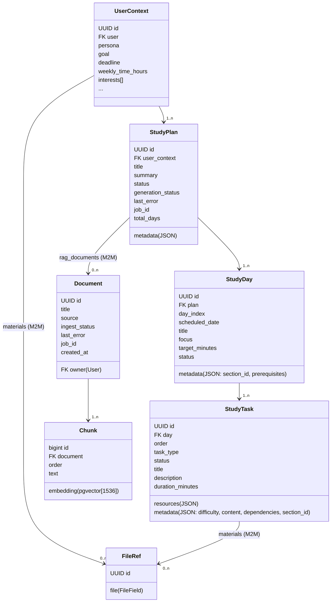
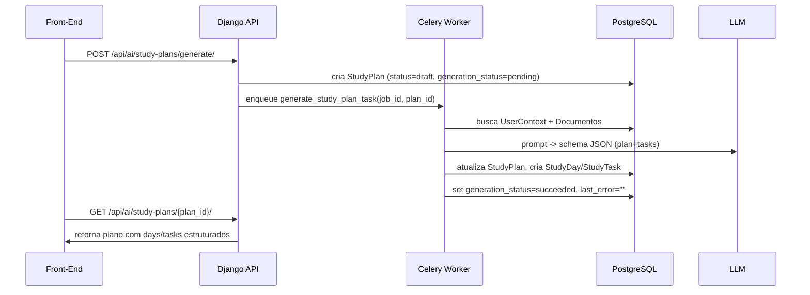

# Modelos de Aprendizado Guiado (Teacher Plus)

Este documento resume os principais modelos persistidos relacionados a planos de estudo, tarefas e materiais utilizados pelo motor de IA do Teacher Plus. Inclui diagramas Mermaid para visualizar relacionamentos e os fluxos assincronos de geração.

## Visão geral das entidades

- **UserContext**: Perfil do estudante (persona, objetivo, prazo, interesses, materiais). Cada usuário possui um único contexto ativo.
- **StudyPlan**: Plano gerado por IA para um UserContext, incluindo seções (dias), status e vínculo com documentos RAG.
- **StudyDay**: Representa uma seção/unidade do plano (1:n com StudyPlan).
- **StudyTask**: Item de aprendizado associado a um StudyDay (flashcard, quiz, lecture, etc.).
- **Document**: Material indexado no módulo RAG (upload, resumo, etc.), ligado aos planos.
- **Chunk**: Fragmento do Document com embedding (pgvector).
- **FileRef**: Referência ao arquivo enviado pelo usuário.

## Diagrama de classes (Mermaid)

## Estrutura detalhada

### UserContext (apps/accounts/models.py)
- **Campos chave**: persona, goal, deadline (Date), weekly_time_hours (int), study_routine, background_level, interests[], preferences, tech info, diagnostic_snapshot, consent_lgpd.
- **Relacionamentos**:
  - `user`: OneToOne com AUTH_USER.
  - `materials`: ManyToMany com FileRef (uploads do usuário).
  - `study_plans`: Reverse FK (related_name) para planos gerados.

### StudyPlan
- **Campos**:
  - `user_context`: FK obrigatório.
  - `title`, `summary`, `status` (draft/active/archived).
  - `generation_status`: pending/running/failed/succeeded (jobs Celery).
  - `last_error`, `job_id`.
  - `total_days`, `metadata` (schema/raw payload do plano).
  - `rag_documents`: M2M com Document (materiais indexados para aquele plano).
- **Ordem**: ordenado por `generated_at` desc.
- **Uso**: cada POST `/study-plans/generate/` cria um StudyPlan e dispara task para preencher `StudyDay`/`StudyTask`.

### StudyDay
- **Campos**:
  - `plan`: FK -> StudyPlan.
  - `day_index`: ordem sequencial.
  - `scheduled_date`, `title`, `focus`, `target_minutes`.
  - `status`: pending/ready/in_progress/completed.
  - `metadata`: inclui `section_id`, `prerequisites`.
- **Constraints**: unique_together `(plan, day_index)`; ordering por `day_index`.

### StudyTask
- **Campos**:
  - `day`: FK -> StudyDay.
  - `order`, `task_type` (lesson/practice/review/flashcards/assessment/project/other).
  - `status`: pending/ready/in_progress/completed.
  - `title`, `description`, `duration_minutes`.
  - `resources`: JSON (URLs, hints).
  - `materials`: M2M com FileRef (arquivos anexados à tarefa).
  - `metadata`: JSON (section_id, difficulty, research_needed, content structured com cards/quizzes, dependencies, etc.).
- **Uso**: front-end consome `metadata.content` para renderizar flashcards, quizzes, lectures.

### Document & Chunk (apps/ai/models.py)
- **Document**:
  - `owner`: FK -> User (pode ser nulo).
  - `source`: upload/study_plan_upload/...
  - `ingest_status`, `last_error`, `job_id` (monitoramento de ingest Celery).
  - `rag_documents`: via M2M em StudyPlan.
- **Chunk**:
  - `document`: FK -> Document.
  - `text`, `order`, `embedding` (VectorField 1536 dims com índice HNSW).
- **Uso**: módulo RAG; endpoints `/api/ai/index/` e `/api/ai/search/`.

### FileRef
- Armazena arquivo enviado (`FileField upload_to=uploads/`).
- Relacionado a UserContext (materiais globais) e StudyTask (materiais por tarefa).
- Referenciado também pelas seeds (SeedsForAI) e ingest Celery.

## Fluxo de geração (Mermaid sequence)

Fluxos para tarefas incrementais (`generate_section_tasks_task`) e ingestão (`ingest_material_task`) funcionam da mesma forma, atualizando `generation_status` no `StudyPlan` ou `ingest_status` no `Document`.

## Observações adicionais
- **metadata JSON**: utilizado para armazenar schema do plano (`sections`, milestones, prerequisites) e conteúdo bruto das tarefas (flashcards, quizzes, etc.). Isso permite versionar prompts sem nova migration.
- **job tracking**: `StudyPlan.job_id` e `Document.job_id` permitem correlacionar com `/api/ai/jobs/{job_id}` e SSE `/jobs/stream/`.
- **RAG integration**: `StudyPlan.rag_documents` permite selecionar apenas os materiais relevantes do usuário ao gerar novos conteúdos via IA.
- **SeedsForAI**: embora não abordado em detalhes aqui, o modelo `SeedsForAI` guarda prompts base (plan_seed, quiz_seed, fsrs_seed) e pode referenciar `rag_corpus` (ManyToMany com FileRef).

Este conteúdo pode ser publicado como Gist para consulta rápida por squads de front-end/produto.
